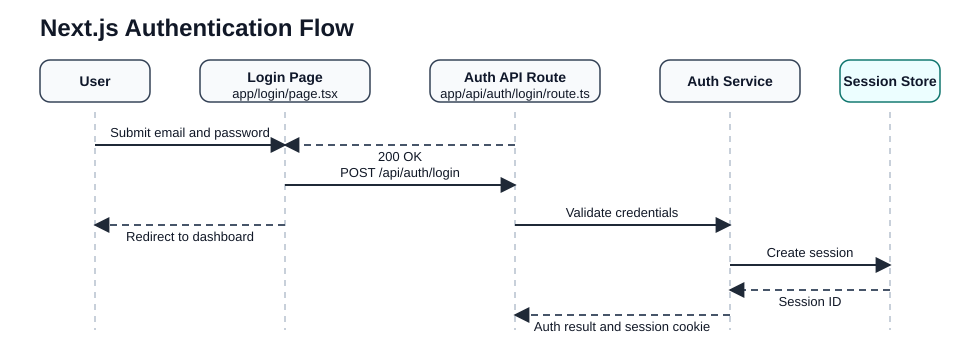

# Architecture

This repository keeps PlantUML source files in `docs/uml/` and commits generated SVG output from `docs/uml/out/` so diagrams render directly in GitHub Markdown.

## Authentication Flow

The example below shows a simple login flow for a Next.js application with an App Router page, an API route, and a backing auth service.

Update [docs/uml/auth-flow.puml](./uml/auth-flow.puml) to change the diagram source. The GitHub Actions workflow regenerates the SVG after pushes to `main`.