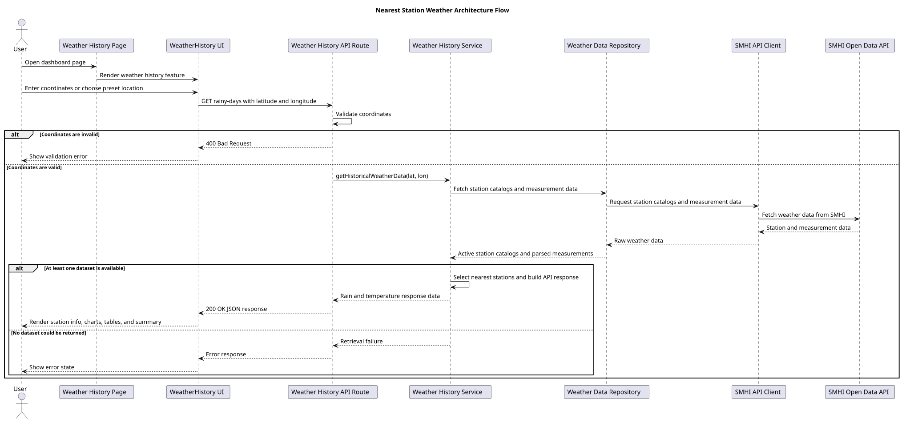
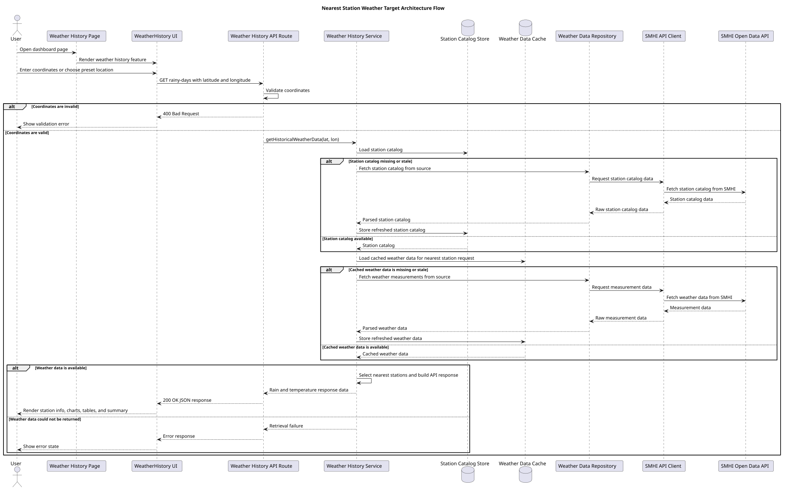
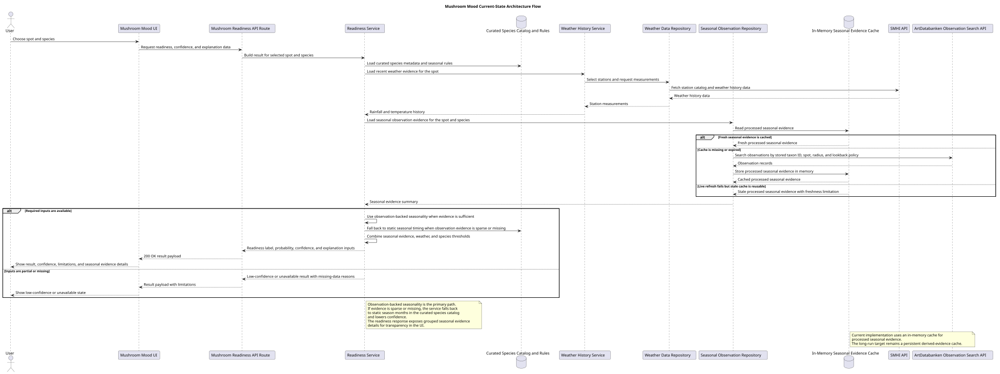
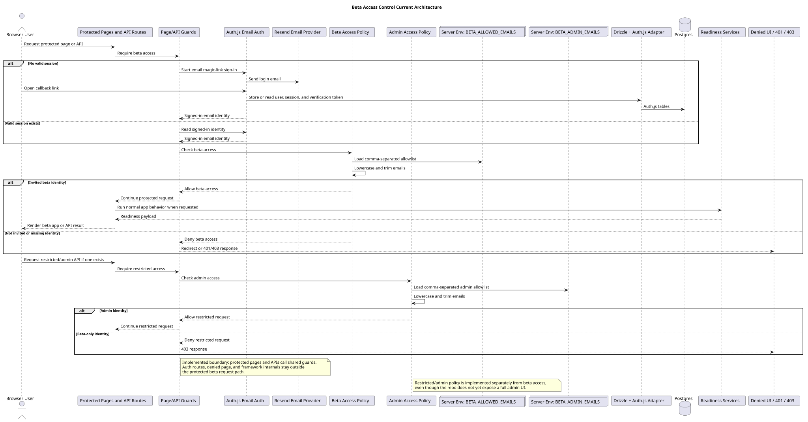
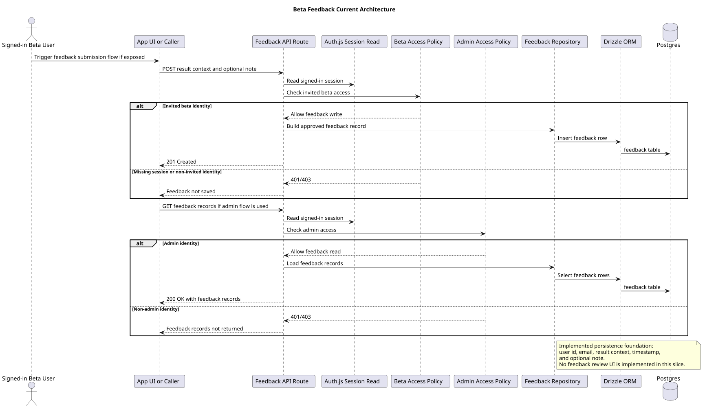
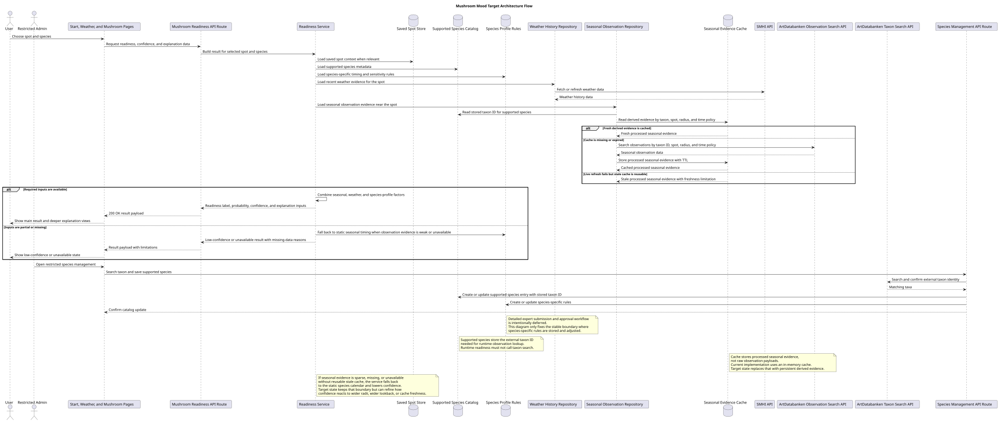
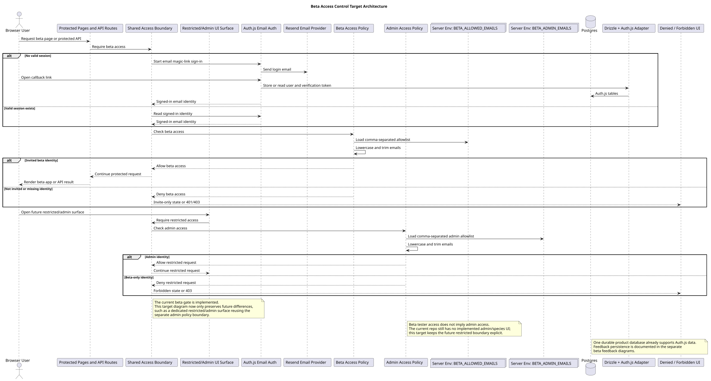
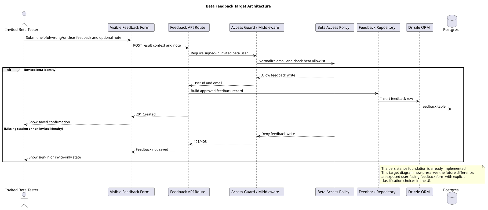

# Architecture

This page covers the app's technical structure.

It keeps current-state diagrams separate from target-state diagrams so implemented behavior and planned changes do not blur together.

## What belongs here

- page and route structure
- service and repository boundaries
- external API integration design
- data flow between app layers

## Current status

The repository includes:

- feature-flow docs in [feature-flows.md](./feature-flows.md)
- a current-state architecture diagram for nearest-station weather
- a current-state architecture diagram for Mushroom Mood
- a current-state architecture diagram for beta access control
- a current-state architecture diagram for beta feedback persistence
- a target-state architecture diagram for Mushroom Mood
- a target-state architecture diagram for nearest-station weather
- a target-state architecture diagram for beta access control
- a target-state architecture diagram for beta feedback persistence

## Available architecture diagrams

### Current-state nearest-station weather

This diagram shows the architecture that the app uses now.

Rendered SVG: `./uml/out/architecture/current/nearest-station-weather.svg`

Source: [nearest-station-weather.puml](./uml/architecture/current/nearest-station-weather.puml)

### Target-state nearest-station weather

This diagram shows the planned architecture for stored station catalog data and cached weather data.

Rendered SVG: `./uml/out/architecture/target/nearest-station-weather.svg`

Source: [nearest-station-weather.puml](./uml/architecture/target/nearest-station-weather.puml)

### Current-state Mushroom Mood

This diagram shows the implemented architecture for the current readiness-result-clarity slice. It covers the UI, the UI-facing result view model, the readiness route, readiness service, curated in-repo species rules, SMHI-backed weather history flow, the seasonal observation repository, the current in-memory seasonal evidence cache, and the static-calendar fallback that exists in code now.

Rendered SVG: `./uml/out/architecture/current/mushroom-mood.svg`

Source: [mushroom-mood.puml](./uml/architecture/current/mushroom-mood.puml)

### Current-state beta access control

This diagram shows the implemented app-level beta access boundary. It covers Auth.js email magic-link sign-in through Resend, page/API guards, env-based beta/admin allowlists, protected app/API routes, and denied/forbidden responses as they exist in code now.

Rendered SVG: `./uml/out/architecture/current/beta-access-control.svg`

Source: [beta-access-control.puml](./uml/architecture/current/beta-access-control.puml)

### Current-state beta feedback persistence

This diagram shows the implemented feedback persistence foundation. It covers the feedback API route, auth/beta checks, feedback repository, Drizzle, and the Postgres feedback table, including the admin-only read boundary that exists in code now.

Rendered SVG: `./uml/out/architecture/current/beta-feedback.svg`

Source: [beta-feedback.puml](./uml/architecture/current/beta-feedback.puml)

### Target-state Mushroom Mood

This diagram shows the planned broader Mushroom Mood architecture beyond the current implementation. It keeps observation-backed seasonality and degraded fallback, while adding saved spots, a persistent derived seasonal-evidence cache, and restricted species-management boundaries that are not implemented yet.

Rendered SVG: `./uml/out/architecture/target/mushroom-mood.svg`

Source: [mushroom-mood.puml](./uml/architecture/target/mushroom-mood.puml)

### Target-state beta access control

This diagram now shows only the future architecture difference beyond the implemented beta gate: a dedicated restricted/admin surface continuing to reuse the separate admin policy boundary.

Rendered SVG after diagram generation: `./uml/out/architecture/target/beta-access-control.svg`

Source: [beta-access-control.puml](./uml/architecture/target/beta-access-control.puml)

### Target-state beta feedback persistence

This diagram now shows only the future difference beyond the implemented persistence foundation: an exposed user-facing feedback submission surface with explicit feedback classifications in the UI.

Rendered SVG after diagram generation: `./uml/out/architecture/target/beta-feedback.svg`

Source: [beta-feedback.puml](./uml/architecture/target/beta-feedback.puml)

## Working approach

- Keep one current-state architecture diagram that matches the code.
- Create a separate target-state diagram for larger planned changes.
- Keep target-state diagrams at the same abstraction level as current-state diagrams.
- Focus on responsibilities and boundaries, not low-level steps.
- When a planned design is stable in code, update the current-state diagram and remove or archive the target-state draft.