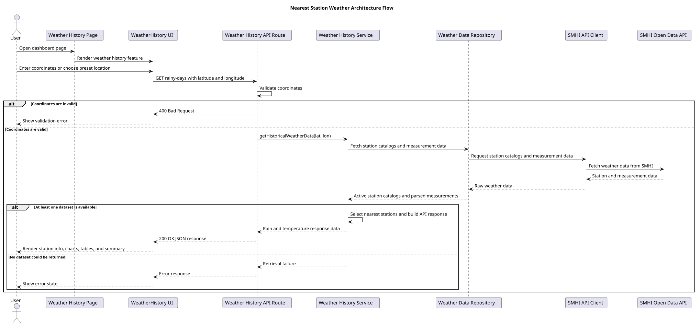
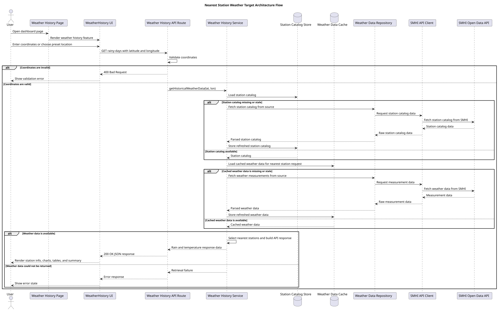
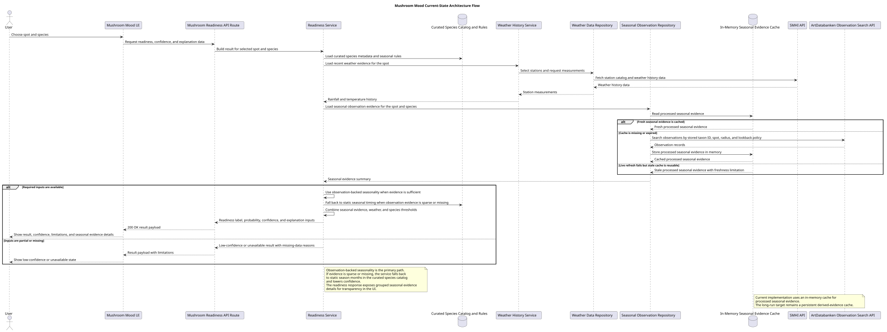

# Architecture

This page covers the app's technical structure.

It keeps current-state diagrams separate from target-state diagrams so implemented behavior and planned changes do not blur together.

## What belongs here

- page and route structure
- service and repository boundaries
- external API integration design
- data flow between app layers

## Current status

The repository includes:

- feature-flow docs in [feature-flows.md](./feature-flows.md)
- a current-state architecture diagram for nearest-station weather
- a current-state architecture diagram for Mushroom Mood
- a target-state architecture diagram for nearest-station weather

## Available architecture diagrams

### Current-state nearest-station weather

This diagram shows the architecture that the app uses now.

Rendered SVG: `./uml/out/architecture-nearest-station-weather.svg`

Source: [architecture-nearest-station-weather.puml](./uml/architecture-nearest-station-weather.puml)

### Target-state nearest-station weather

This diagram shows the planned architecture for stored station catalog data and cached weather data.

Rendered SVG: `./uml/out/architecture-nearest-station-weather-target.svg`

Source: [architecture-nearest-station-weather-target.puml](./uml/architecture-nearest-station-weather-target.puml)

### Current-state Mushroom Mood

This diagram shows the implemented architecture for the spot-first Mushroom Mood flow. It covers readiness calculation boundaries, saved spots, supported species, weather evidence, and seasonal evidence.

Rendered SVG: `./uml/out/architecture-mushroom-mood.svg`

Source: [architecture-mushroom-mood.puml](./uml/architecture-mushroom-mood.puml)

## Working approach

- Keep one current-state architecture diagram that matches the code.
- Create a separate target-state diagram for larger planned changes.
- Keep target-state diagrams at the same abstraction level as current-state diagrams.
- Focus on responsibilities and boundaries, not low-level steps.
- When a planned design is stable in code, update the current-state diagram and remove or archive the target-state draft.