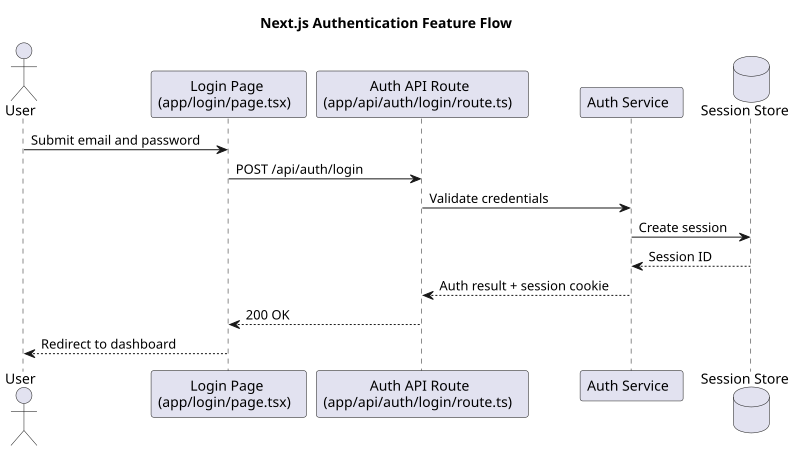

# Feature Flows

This page collects diagrams that explain user-facing or business-facing behavior.

## Authentication flow

This example shows the login flow from user input to session creation and redirect.

Source: [feature-auth-flow.puml](./uml/feature-auth-flow.puml)

## What belongs here

- Login and signup flows
- Weather search and filtering flows
- Rain-history lookup and result flows
- Error and empty-state flows when they affect user behavior