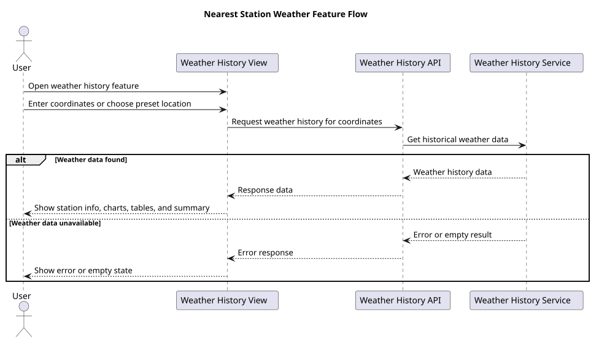
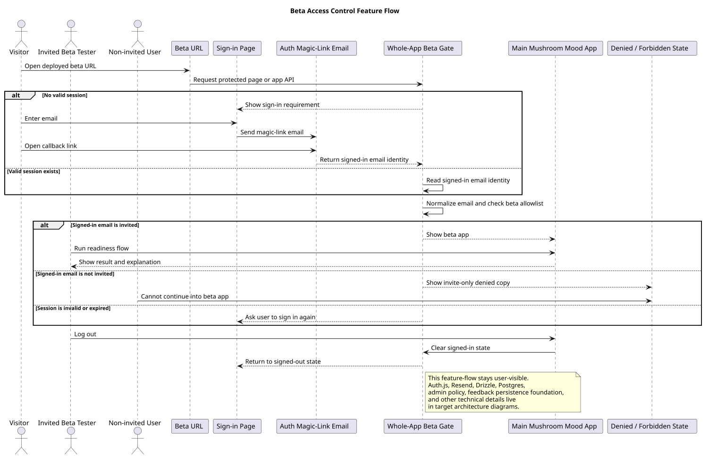
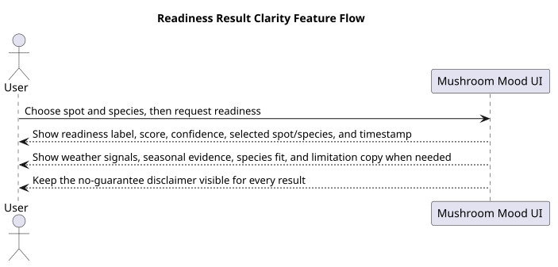
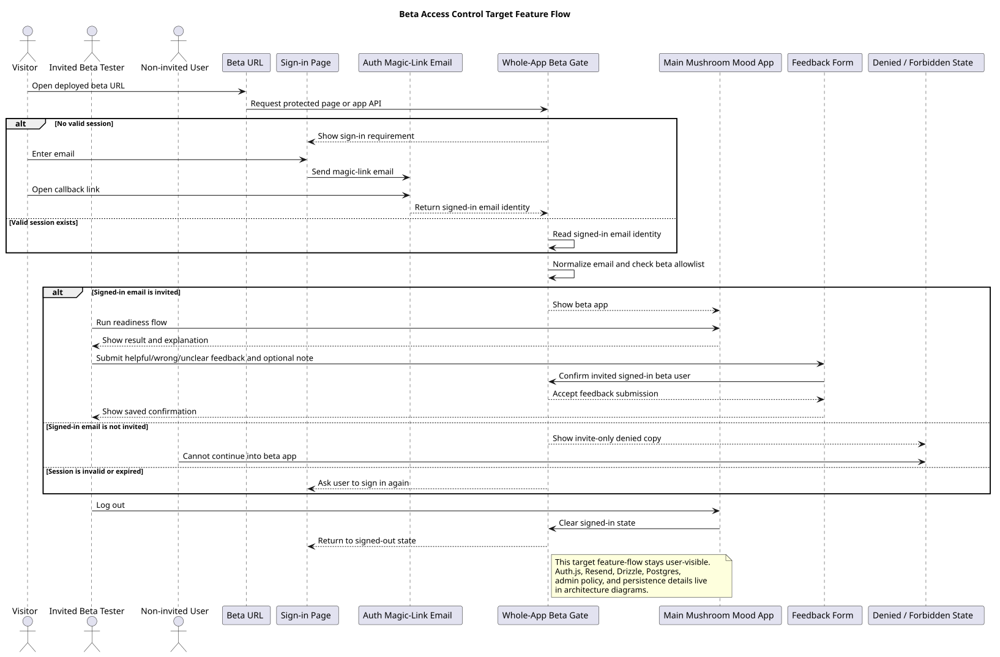
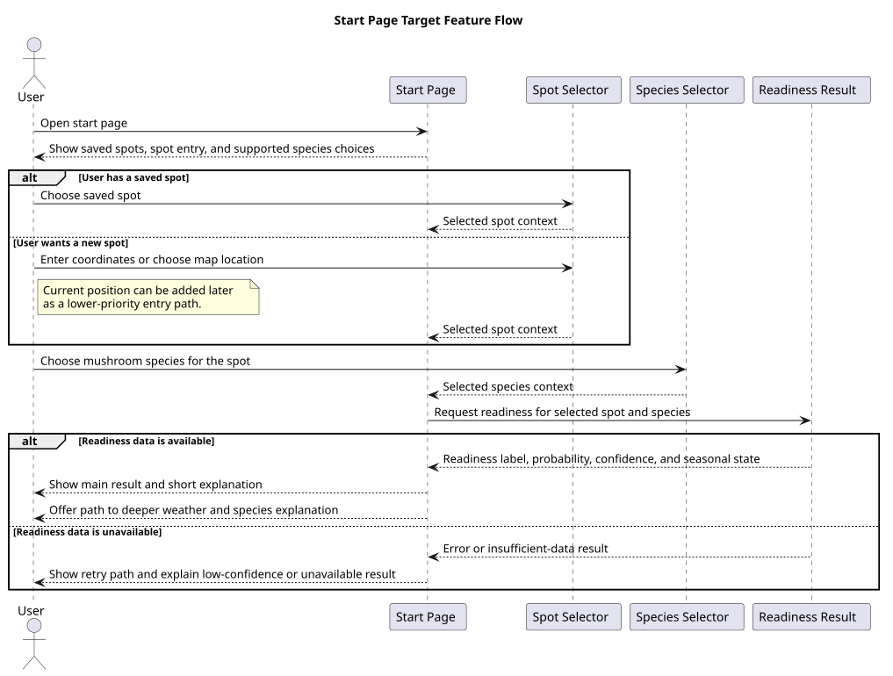
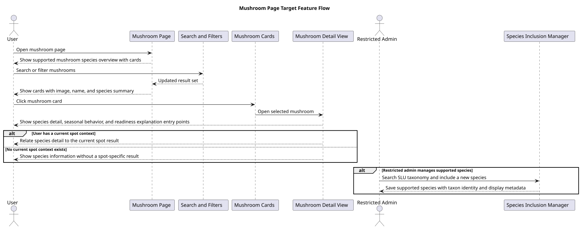
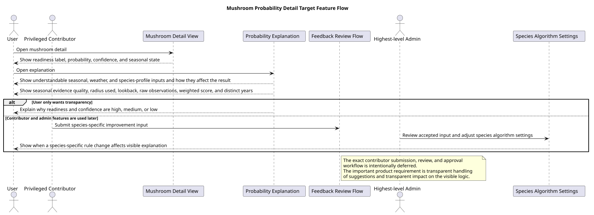
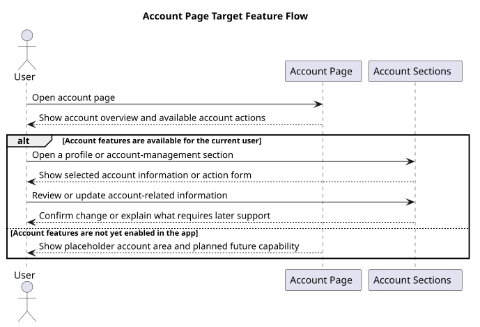
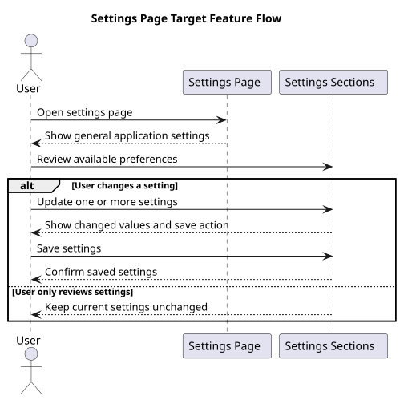

# Feature Flows

This page collects diagrams for user-facing behavior.

Use this location rule:

- `docs/uml/feature/current/<name>.puml` means the current implemented user-visible flow.
- `docs/uml/feature/target/<name>.puml` means a planned or in-progress user-visible flow.

## Current implemented flows

### Nearest-station weather

This diagram shows the weather-history flow from opening the feature to seeing results or an error state.

Rendered SVG: `./uml/out/feature/current/nearest-station-weather.svg`

Source: [nearest-station-weather.puml](./uml/feature/current/nearest-station-weather.puml)

It complements the architecture diagrams in [architecture.md](./architecture.md) but stays focused on what the user sees.

### Beta access control

This diagram shows the current implemented beta-only entry flow: email magic-link sign-in, invite-only access, denied states, and logout. Feedback persistence exists as technical foundation in this slice, but a user-visible feedback submission surface is not shown here because it is not currently exposed in the implemented UI.

Rendered SVG after diagram generation: `./uml/out/feature/current/beta-access-control.svg`

Source: [beta-access-control.puml](./uml/feature/current/beta-access-control.puml)

### Mushroom probability detail

This diagram shows the current implemented explanation transparency flow after a user opens a mushroom detail or readiness explanation.

Rendered SVG: `./uml/out/feature/current/mushroom-probability.svg`

Source: [mushroom-probability.puml](./uml/feature/current/mushroom-probability.puml)

## Planned main-page flows

These diagrams describe the main user journeys that will guide upcoming architecture, testing, and implementation work.

### Beta access control target

This target diagram shows the broader planned beta-only entry journey after a user-visible feedback submission surface is exposed: email magic-link sign-in, invite-only access, result review, feedback submission, denied states, and logout.

Rendered SVG after diagram generation: `./uml/out/feature/target/beta-access-control.svg`

Source: [beta-access-control.puml](./uml/feature/target/beta-access-control.puml)

### Start page

This diagram shows the main spot-check flow: choose a saved or entered spot, choose a mushroom species, and get a readiness result with probability, confidence, and seasonal state.

Rendered SVG: `./uml/out/feature/target/start-page.svg`

Source: [start-page.puml](./uml/feature/target/start-page.puml)

### Weather page

This diagram shows the evidence flow on the weather page. The user can inspect the weather and seasonal inputs behind a readiness result and switch spot or species.

Rendered SVG: `./uml/out/feature/target/weather-page.svg`

Source: [weather-page.puml](./uml/feature/target/weather-page.puml)

### Mushroom page

This diagram shows the species-catalog flow: browse or search supported mushrooms, inspect species details, and, for restricted users, manage which species the app supports.

Rendered SVG: `./uml/out/feature/target/mushroom-page.svg`

Source: [mushroom-page.puml](./uml/feature/target/mushroom-page.puml)

### Mushroom probability detail target

This supporting target diagram shows the later planned contributor and admin flow around species-specific improvement input after the current explanation transparency flow.

Rendered SVG: `./uml/out/feature/target/mushroom-probability.svg`

Source: [mushroom-probability.puml](./uml/feature/target/mushroom-probability.puml)

## Planned side-page flows

These diagrams are lighter than the main-page flows. They reserve space in the planning set without forcing more detail than the current product scope supports.

### Account page

This diagram shows the basic account-area flow: open account pages, inspect profile or access information, and manage future account actions when that scope is defined.

Rendered SVG: `./uml/out/feature/target/account-page.svg`

Source: [account-page.puml](./uml/feature/target/account-page.puml)

### Settings page

This diagram shows the settings flow: open settings, review preferences, change values, and save them.

Rendered SVG: `./uml/out/feature/target/settings-page.svg`

Source: [settings-page.puml](./uml/feature/target/settings-page.puml)

## What belongs here

- login and signup flows
- weather search and filtering flows
- weather history lookup and result flows
- error and empty-state flows that change user behavior