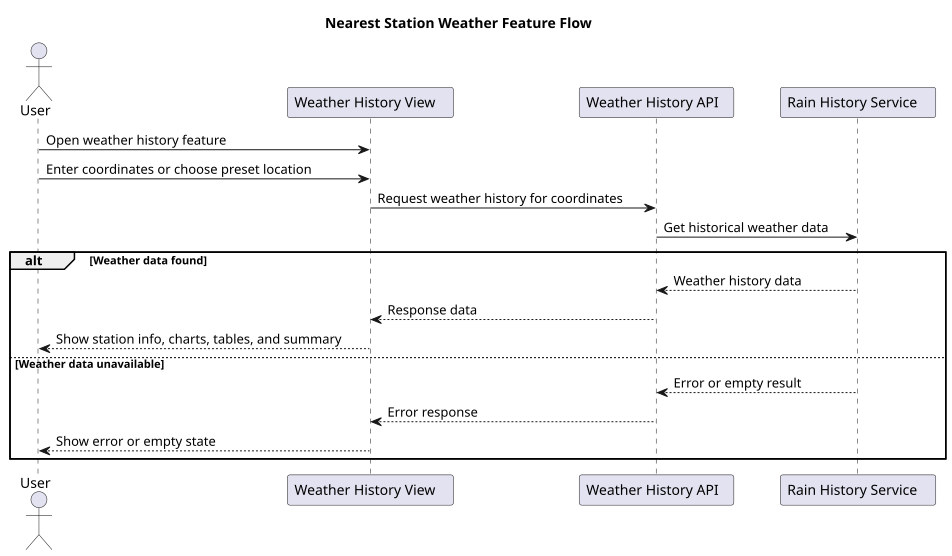
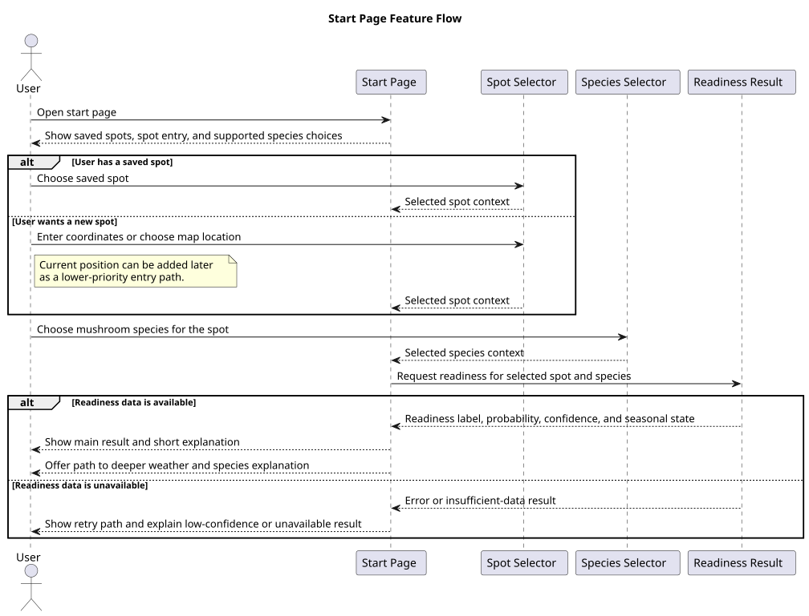
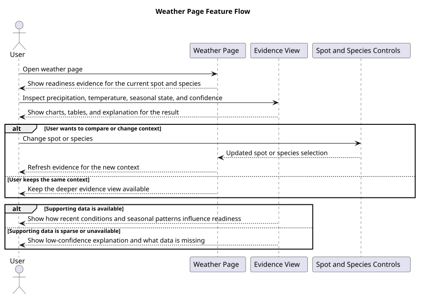
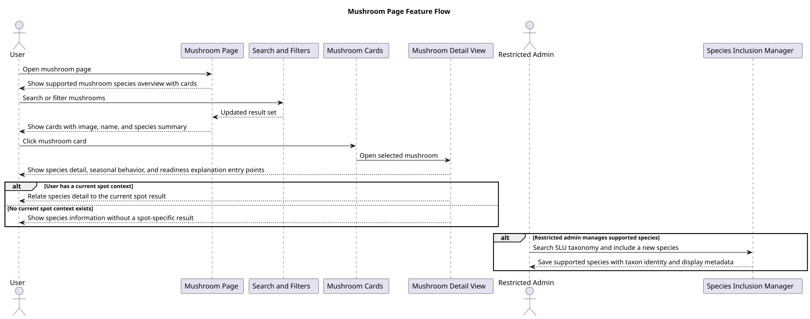
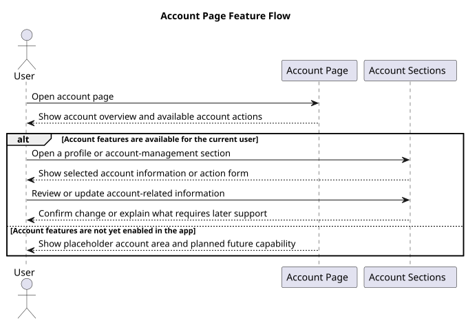

# Feature Flows

This page collects diagrams that explain user-facing or business-facing behavior.

## Available feature flows

## Current implemented flow

### Nearest station weather feature flow

This diagram shows the user-facing weather history flow from opening the feature to requesting data and seeing either results or an error state.

Rendered SVG: generated into `./uml/out/feature-nearest-station-weather.svg`

Source: [feature-nearest-station-weather.puml](./uml/feature-nearest-station-weather.puml)

This feature flow complements the architecture diagrams in [architecture.md](./architecture.md), but stays focused on user-visible behavior instead of internal technical responsibilities.

## Planned main-page flows

These diagrams describe the intended user experience for the three main pages that will drive upcoming architecture, testing, and implementation planning.

### Start page feature flow

This diagram shows the main spot-checking journey on the start page: choose a saved or entered spot, choose a mushroom species, and receive a readiness result with probability, confidence, and seasonal state.

Rendered SVG: generated into `./uml/out/feature-start-page.svg`

Source: [feature-start-page.puml](./uml/feature-start-page.puml)

### Weather page feature flow

This diagram shows the deeper evidence journey on the weather page, where the user can inspect the weather and seasonal inputs behind a readiness result and switch spot or species.

Rendered SVG: generated into `./uml/out/feature-weather-page.svg`

Source: [feature-weather-page.puml](./uml/feature-weather-page.puml)

### Mushroom page feature flow

This diagram shows the species-catalog journey: browse or search supported mushrooms, inspect species details, and, for restricted users, manage which species are included in the app.

Rendered SVG: generated into `./uml/out/feature-mushroom-page.svg`

Source: [feature-mushroom-page.puml](./uml/feature-mushroom-page.puml)

### Mushroom probability detail flow

This supporting diagram focuses on what happens after a user opens a mushroom detail or readiness explanation and wants to understand why a result is shown, including the planned but not yet fully designed expert-input path.

Rendered SVG: generated into `./uml/out/feature-mushroom-probability.svg`

Source: [feature-mushroom-probability.puml](./uml/feature-mushroom-probability.puml)

## Planned side-page flows

These diagrams are intentionally lighter than the main-page flows. They exist to reserve structure in the planning set without pushing account and settings design further than the current product definition supports.

### Account page feature flow

This diagram captures the basic account-area journey: open account pages, inspect profile or access-related information, and manage future account-related actions once that scope is defined.

Rendered SVG: generated into `./uml/out/feature-account-page.svg`

Source: [feature-account-page.puml](./uml/feature-account-page.puml)

### Settings page feature flow

This diagram captures the general settings journey: open settings, review available application preferences, adjust values, and save changes.

Rendered SVG: generated into `./uml/out/feature-settings-page.svg`

Source: [feature-settings-page.puml](./uml/feature-settings-page.puml)

## What belongs here

- Login and signup flows
- Weather search and filtering flows
- Rain-history lookup and result flows
- Error and empty-state flows when they affect user behavior